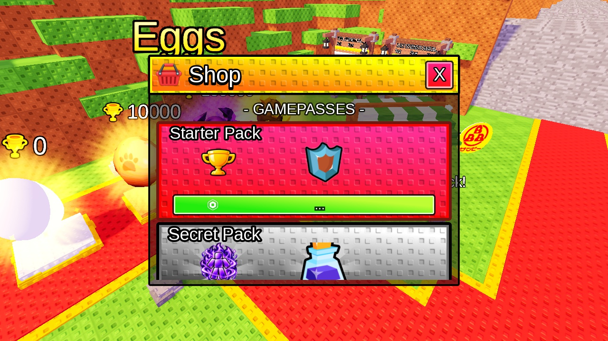
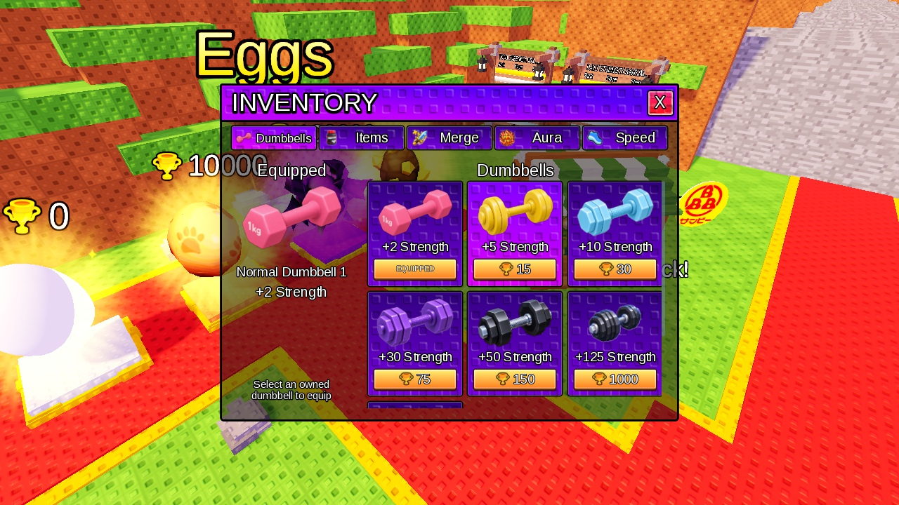
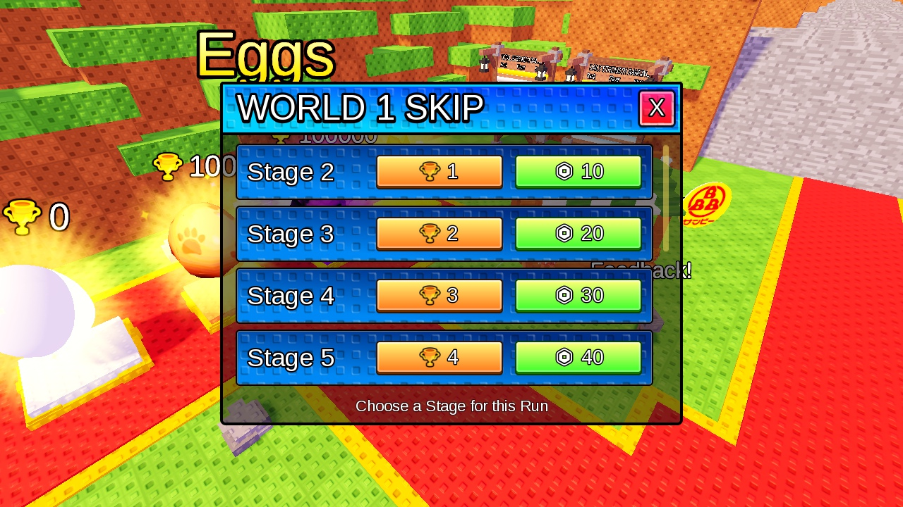

# Inventory / Skip — purchased Shop alignment

This supersedes the pastel styling in the earlier review. All images are actual Studio Edit captures of purchased artwork. No generated image or substitute UI asset was used.

## Same-size comparison

All three captures use the same 1280×720 viewport and camera. For comparison, panel width is approximately648px: Shop648×480, Inventory648×475 (900×660 design at0.72), Skip648×480. These comparison-only sizes were not saved as gameplay overrides.

| Purchased Shop | Purple Inventory | Blue Skip |
|---|---|---|
|  |  |  |

The donor is `StarterGui.StrengthGui.ShopPanel`: `Top`, `Top.Close`, `MainScrollingFrame.Holder.Card01_SecretPack`, its Title/Benefits/Owned.PriceTag and stroke/gradient/StudPattern objects. The body copies Shop's RGB7,7,12 at0.5 transparency. Inventory headers use saturated purple; Skip headers use saturated cyan/blue. Cards are separate darker saturated surfaces with gaps. Body/equipment/list wrappers are transparent and have no stud fill or redundant pane border. Purchased90px tiles retain their apparent size under Inventory scaling; header/card opacity comes from the donor. Existing yellow Win/green Robux artwork and price/handler paths are retained.

Inventory equipment occupies approximately29% of the content width; the right list starts at30%. Dumbbells use3 columns and206px cards (186px short landscape), replacing2 columns of310px cards. Items retain3 columns with a wider list and compact equipment sockets. Short-layout Best Equip and sockets no longer overlap. Skip uses76px rows,12px gaps, aligned Stage/Win/Robux controls and automatic vertical canvas sizing.

## Other actual views

| Check | Image |
|---|---|
| Items, Equip/Equipped and9-card list | [Items](Inventory_Aligned_Items.jpg) |
| Aura cards and purchased Win controls | [Aura](Inventory_Aligned_Aura.jpg) |
| Speed and purchased Win/Robux controls | [Speed](Inventory_Aligned_Speed.jpg) |
| Merge initial screen, cleaned legacy glyph strokes | [Merge](Inventory_Aligned_Merge_Final.jpg) |
| Merge owned-item selection renderer | [Selection](Inventory_Aligned_Merge_Selection.jpg) |
| Japanese width sample,844×390-equivalent Inventory | [Japanese Inventory](Inventory_Aligned_Japanese.jpg) |
| Japanese Skip, same short-landscape limit, Stage10 fully visible | [Japanese Skip end](Skip_Aligned_Japanese_End.jpg) |

## What was checked

- Actual saved CurrentCloud loaded in Studio Edit. All five Inventory renderers were exercised with [the existing display-only fixture](../tests/InventorySkinEditPreview.luau); Remote writes and purchase prompts were blocked. Reopen, Owned/Equipped updates, nine rarity5 cards, old-color repaint protection, duplicate bind protection, scroll endpoints and compact equipment bounds were checked. Merge selection uses memory-only owned cards with CanMerge=false; it does not prove server merge eligibility or execution.
- Japanese samples use existing CSV wording for headings/tabs/equipment/Stage. They test glyph rendering and width, not automatic translation delivery. No localization Source was changed. Mobile checks are viewport-equivalent landscape checks, not physical-device/touch or portrait validation.
- Some assets appeared only after content preloading. Speed's Marketplace price stays`...` in this offline fixture because network price calls are suppressed. Live asset timing and Marketplace fetch behavior are unchanged and unverified.
- Three production Sources and the fixture compile. Same-file reDecode, dense referents/header/INST/PRNT, reference targets, SharedString indexes and UniqueId checks passed. [Property provenance and verification](Inventory_Skip_Shop_Alignment.json).
- Cloud was not updated. Live startup, input/purchase/equip/merge/save, server-driven UI refresh and automatic localization remain unverified. No local Play, purchase, Save/Publish, backup or alternate rbxl was invoked by this agent.

## Mid-task file change

At12:20:57, the target was independently reserialized while the disposable Edit preview was open. The agent issued no Save/Publish call; the save caller is unknown. Its hash changed from`ab11b282…` to`7eab2a32…`, with181684 instances. The hash guard stopped a stale write. All final Source changes were already present, along with temporary preview UI.

Cleanup identified1418 generated UI instances by the verification session's UniqueId suffix AND membership in the two target panels. None had an original child. Only those preview objects were removed, recorded original presentation properties were restored, Japanese width samples were removed from saved Skip labels, and StageSkipGui.Enabled was restored totrue. All out-of-scope instances from the latest file were retained, including17 net additional engine/session instances; no older rbxl was restored. Final validation reports180266 instances,76155 reference values,381 SharedStrings/206364 indexes and0 duplicate UniqueIds. Final hash and cleanup scope are in the JSON record.

This record distinguishes the confirmed Edit appearance from Cloud behavior. The user-side save/handwork question was unanswered at cleanup; deletion was narrowed to positively identified temporary objects in the authorized UI scope.

- Preview-save cleanup also restored visibility of StrengthGui.HUD/LeftMenu/StrengthLevelHUD and Enabled on LevelUpGui/StrengthGainGui/WorldTravelGui/World1DoubleWinGui. These were hidden for screenshots; existing clients require their containers enabled. No styling or Source of those other screens changed; purchased ScreenGui and legacy Merge screen remain disabled. Final additional load checks use only read-only inspection, without executing a fixture.

Final read-only Studio load (PID34988) passed with no persisted fixture, restored startup containers and unchanged final hash. Dedicated verification process and target.lock are absent.
